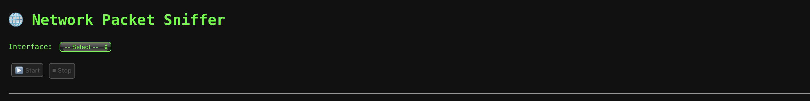
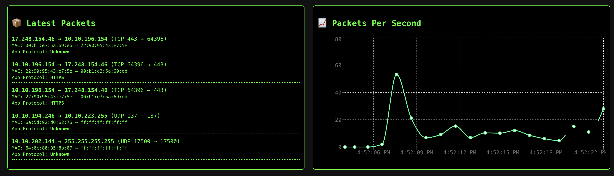
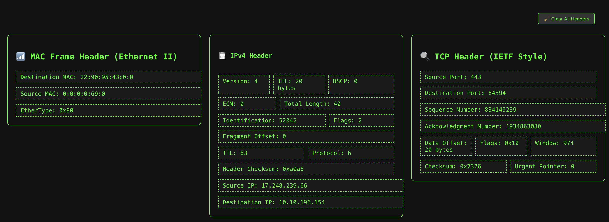
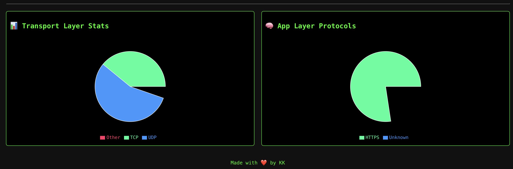

# 🛡️ Network Packet Sniffer & Analyzer

A real-time packet sniffing and analysis tool focused on **network traffic inspection**, **protocol parsing**, and **live monitoring**. It leverages **Python (Scapy)** for packet capture and **WebSockets (Socket.IO)** to stream data to a minimalist React dashboard.

Primarily designed as a backend-focused system-level project to deepen understanding of IP/TCP/UDP headers, MAC frames, and basic traffic analysis logic.

---

## ⚙️ Core Highlights

- 🔎 **Low-Level Packet Sniffing** using Scapy (Python)
- 🧠 **Header Parsing**: MAC (Ethernet II), IPv4, TCP/UDP
- 📡 **Real-Time Data Streaming** using Socket.IO (Node.js)
- 📊 **Live Traffic Visualization** (React only for display purposes)
- 🔧 Designed for security-minded developers, not frontend engineers

---

## 🖼️ Screenshots

### 1️⃣ Interface & Interface Selection



---

### 2️⃣ Real-Time Packet Feed + Per Second Rate



---

### 3️⃣ Deep Packet Inspection View (MAC + IP + UDP)



---

### 4️⃣ Protocol Distribution (Transport & Application Layer)



---

## 🛠️ Stack (Logic-Oriented)

| Role              | Tech Used            |
|-------------------|----------------------|
| Packet Capture    | Python + Scapy       |
| Transport Bridge  | Node.js + Socket.IO  |
| Visualization     | React.js (Minimal UI)|
| Charts            | Chart.js             |

---

## 🚀 How to Run

### 1. Start the Backend (WebSocket Server)

```bash
cd web-sniffer/backend
npm install
node index.js
